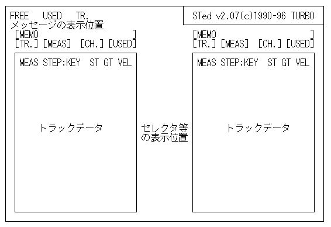

# エディット画面の説明

## トラックデータの所に表示されるパラメータの説明
スペシャルコントローラは水色で表示、和音の場合は黄色で表示します
<dl>
  <dt>MEAS</dt>
  <dd>小節番号（そのトラック内での、曲の先頭からの小節番号）</dd>
  <dt>STEP</dt>
  <dd>小節内のステップ（データの発音タイミング順の番号）</dd>
</dl>

### ノートデータ

NOTE(K#)、ST、GT、VEL：音符・休符を表すデータ

<dl>
  <dt>NOTE</dt>
  <dd>
    ノートネーム(NOTE NAME) 
    - 音名 <code>\{C,D,E,F,G,A,B\}\{+,-,=,#,b,n\}\{0,1,2,3,4,5,6,7,8,9\}</code>
  </dd>
  <dt>K#</dt>
  <dd>
    キーナンバー(KEY NO.) 
    - 鍵盤の番号（中央のC鍵を60番として、0から127） 
    - 入力する時は、ノートネームとキーナンバーのどちらで入力しても構いません。
  </dd>
  <dt>ST</dt>
  <dd>
    ステップタイム(STEP TIME) 
    - 次のデータに移るまでの時間(0～255)
    - Timebase=48の時は48で四分音符
    - 和音の場合は、最後の音以外のSTを0にします。その場合は、STを表示しません。
  </dd>
  <dt>GT</dt>
  <dd>
    ゲートタイム(GATE TIME) 
    鍵盤を押さえている時間(0～255) 
    - タイを指定する時は、STよりGTを1以上大きくして下さい。その場合はGTの後に'*'が表示されます
    - 休符を指定する場合は、GTを0にして下さい。VELを0にした場合も、休符扱いになります。
  </dd>
  <dt>VEL</dt>
  <dd>
    ベロシティ(VELOCITY) 
    - 鍵盤を叩く強さ(0～127)
  </dd>
</dl>

### ノート以外のデータ

<dl>
  <dt>REPEAT [</dt>
  <dd>リピートの開始</dd>

  <dt>       ]</dt>
  <dd>リピートの終了</dd>

  <dt>--------</dt>
  <dd>小節線 (MEAS END)</dd>

  <dt>========</dt>
  <dd>小節複写 (SAME MEAS)</dd>

  <dt>MusicKey</dt>
  <dd>小節内のキー</dd>

  <dt>[      ]</dt>
  <dd>コメント</dd>
</dl>

### スペシャルコントローラ
<dl>
  <dt>PROGRAM</dt>
  <dd>プログラム・チェンジ</dd>
  <dt>BankProg</dt>
  <dd>バンク＆プログラム・チェンジ</dd>
  <dt>MIDI CH.</dt>
  <dd>MIDIチャンネル・チェンジ</dd>
  <dt>TEMPO</dt>
  <dd>テンポ・チェンジ</dd>
  <dt>PITCH</dt>
  <dd>ピッチ・ベンド</dd>
  <dt>AFTER C.</dt>
  <dd>チャンネル・アフタータッチ（チャンネル・プレッシャー）</dd>
  <dt>AFTER K.</dt>
  <dd>ポリフォニック・アフタータッチ（キー・プレッシャー）</dd>
  <dt>CONTROL</dt>
  <dd>コントロール・チェンジ</dd>
  <dt>MODULAT</dt>
  <dd>モジュレーション</dd>
  <dt>VOLUME</dt>
  <dd>ヴォリューム</dd>
  <dt>PANPOT</dt>
  <dd>パンポット</dd>
  <dt>EXPRESS</dt>
  <dd>エクスプレッション</dd>
  <dt>HOLD1</dt>
  <dd>ホールド1（ダンパーペダル）</dd>
  <dt>BANK MSB,LSB</dt>
  <dd>バンク・セレクト</dd>
  <dt>REVERB</dt>
  <dd>エフェクト1（リバーブ・センドレベル）</dd>
  <dt>CHORUS</dt>
  <dd>エフェクト3（コーラス・センドレベル）</dd>
  <dt>DELAY</dt>
  <dd>エフェクト4（ディレイ・センドレベル）</dd>
  <dt>PORTA.TM</dt>
  <dd>ポルタメント・タイム</dd>
  <dt>PORTAMEN</dt>
  <dd>ポルタメント・スイッチ</dd>
  <dt>POR.CONT</dt>
  <dd>ポルタメント・コントロール</dd>
  <dt>SOSTENUT</dt>
  <dd>ソステヌート</dd>
  <dt>SOFT</dt>
  <dd>ソフトペダル</dd>
  <dt>NRPN LSB,MSB</dt>
  <dd>ノン・レジスタード・パラメータ・ナンバー</dd>
  <dt>RPN LSB,MSB</dt>
  <dd>レジスタード・パラメータ・ナンバー</dd>
  <dt>DATA LSB,MSB</dt>
  <dd>データ・エントリー</dd>
  <dt>RES.ALL</dt>
  <dd>リセット・オール・コントローラーズ</dd>
  <dt>SOND OFF</dt>
  <dd>オール・サウンド・オフ</dd>
  <dt>NOTE OFF</dt>
  <dd>オール・ノート・オフ</dd>
  <dt>UserExc0～7</dt>
  <dd>ユーザー定義エクスクルーシブ</dd>
  <dt>Tr.Exclu</dt>
  <dd>トラックエクスクルーシブ</dd>
  <dt>Rol.Dev#</dt>
  <dd>ローランド・デバイスナンバー&モデルID</dd>
  <dt>Rol.Base</dt>
  <dd>ローランド・ベースアドレス</dd>
  <dt>Rol.Para</dt>
  <dd>ローランド・アドレス&パラメータ</dd>
</dl>

## トラックデータ以外に表示されるデータ
### メッセージエリア

<dl>
  <dt>FREE:</dt>
  <dd>バッファの空き領域のステップ数</dd>
  <dt>USED:</dt>
  <dd>曲全体の使用ステップ数</dd>
  <dt>TR.:</dt>
  <dd>編集中のトラック番号</dd>
</dl>

### エディットエリア

<dl>
  <dt>M:</dt>
  <dd>編集中のトラックのコメント</dd>
  <dt>TR.:</dt>
  <dd>編集中のトラック番号</dd>
  <dt>MEAS:</dt>
  <dd>編集位置の小節番号</dd>
  <dt>CH.:</dt>
  <dd>編集位置のチャンネル番号</dd>
  <dt>USED:</dt>
  <dd>編集中のトラックの使用ステップ数</dd>
</dl>
