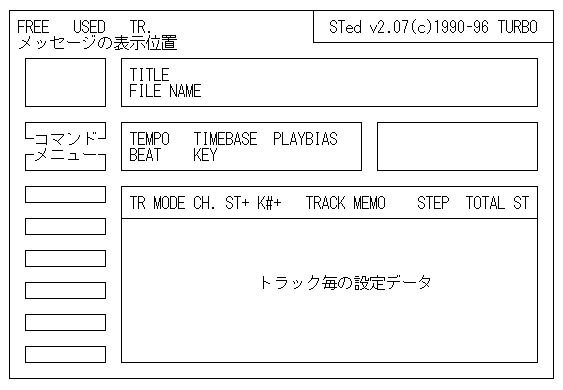

# メイン画面の説明

## トラックセットデータの所に表示されるパラメータの説明
<dl>
  <dt>TR</dt>
  <dd>トラックナンバー</dd>

  <dt>MODE</dt>
  <dd>プレイモード</dd>

  <dt>CH.</dt>
  <dd>MIDIチャンネル</dd>

  <dt>ST+</dt>
  <dd>演奏のタイミング</dd>

  <dt>K#+</dt>
  <dd>音程のシフト値</dd>

  <dt>RHY</dt>
  <dd>リズムトラックスイッチ</dd>

  <dt>TRACK MEMO</dt>
  <dd>コメント</dd>

  <dt>STEP</dt>
  <dd>トラック毎の使用ステップ数</dd>

  <dt>TOTAL ST</dt>
  <dd>トラック毎のトータルST(255/256回ループは無視)</dd>
</dl>
