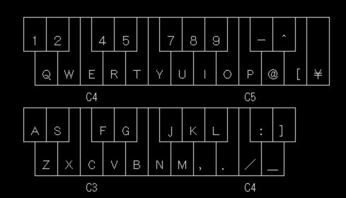

# セレクタ

## コマンドセレクタのキー操作

- [↑] 
  カーソルを一つ上に動かす。 
  上端にカーソルがある時は、下端に移動します。
- [↓] 
  カーソルを一つ下に動かす。 
  下端にカーソルがある時は、上端に移動します。
- [RET]/[SPACE] 
  決定（水色の反転になります。）
- [ A ]〜[ X ] 
  直接選択・実行 
  コマンドを直接選択・実行する。
- [OPT.1]+[ A ]〜[ Z ] 
  オプション直接選択・実行 
  "OPTION"に設定されているコマンドを直接選択・実行する。
- [ Z ] 
  音源の初期化(CM-64/SC-55) 
  コントロールデータのファイル名が設定してあれば、CM-64/SC-55に転送します。
- [XF3] 
  演奏再開
- [XF4] 
  演奏一時停止
- [XF5] 
  演奏停止

## ファイルセレクタ（ファイルネーム設定ウインドウ）のキー操作

### 設定モード

画面の右にウインドウが開いて、ファイル名を聞いてきます。 
[↓]を押せばセレクトモードに移行します。キャンセルする時は、[ESC]を押して下さい。 
ドライブ名を指定すれば、そのドライブに移動してセレクトモードになります。 
フルパスでファイルを指定すれば、直接ロード/セーブ出来ます。

### セレクトモード

- [↑] 
  カーソルを一つ上に動かす。 
  上端にカーソルがある時は、1行ロールダウンします。
- [↓] 
  カーソルを一つ下に動かす。 
  下端にカーソルがある時は、1行ロールアップします。
- [→]/[←] 
  ドライブを切り換える。
- [R.UP] 
  1ページ進める。
- [R.DW] 
  1ページ戻す。
- [HOME] 
  カーソルを最初に戻す
- [RET] 
  決定/ディレクトリ移動
- [UNDO]/[BS] 
  1つ前のディレクトリに移動する。
- [ESC]/[DEL] 
  キャンセル(設定モードに戻る)
- [SPACE] 
  カーソル位置のファイルのメモを表示する。
- [T]/[M]/[U]/[A] 
  カーソル位置のRCPファイルからメモ等だけをロードする。
  - [T] Title
  - [M] Memo
  - [U] User Exclusive
  - [A] Rhythm Assign

## トラックセレクタのキー操作

- [↑] 
  カーソルを一つ上に動かす。 
  上端にカーソルがある時は、下端に移動します
- [↓] 
  カーソルを一つ下に動かす。
  下端にカーソルがある時は、上端に移動します。
- [HOME] 
  カーソルを一番上の行に動かす。
- [TAB] 
  トラックナンバーを直接指定する(1〜36)
- [R.UP]/[R.DW] 
  表示するトラックの範囲を9トラック単位で移動する
- [RET] 
  決定（水色の反転になります。）
- [ESC] 
  コマンドメニューに戻る

## タグジャンプセレクタのキー操作

- [↑] 
  カーソルを一つ上に動かす。 
  上端にカーソルがある時は、下端に移動します。
- [↓] 
  カーソルを一つ下に動かす。 
  下端にカーソルがある時は、上端に移動します。
- [ A ]〜[ V ] 
  直接選択 
  タグを直接選択する。
- [HOME] 
  カーソルを最初に戻す
- [RET] 
  移動/登録（登録時にトラックも設定します。）
- [SPACE] 
  移動/登録（登録時にトラックは設定しません。）
- [ESC] 
  コマンドメニューに戻る

## トーンセレクタのキー操作

- [↑] 
  カーソルを一つ上に動かす。 
  上端にカーソルがある時は、1行ロールダウンします。
- [↓] 
  カーソルを一つ下に動かす。 
  下端にカーソルがある時は、1行ロールアップします。
- [CTRL]+[←]/[→] 
  リストチェンジ 
  セレクトする音色リストを切り替えます。 
  （EDITの場合は、他のパートに割り当てられている音色リストに切り替えます。（設定出来るのは、最初に表示されているパートの音色のみ）） 
  （LA/RHY. PATCH WRITEの場合は、USER ↔ RHYTHMを切り替え） 
  （PCM PATCH WRITEの場合は、INTERNAL ↔ CARDを切り替え）
- [←]/[→] 
  バンクチェンジ 
  GS/GMパートの場合のみ、バリエーションを切り替えます。
- [CLR] 
  リストリセット 
  EDITの場合は、リストを呼び出された時の表示に戻します。
- [ / ] 
  バンク対応セレクトモード 
  GS/GMパートの場合のみ、すべてのバンクを一列に表示したリストからのセレクトモードに入ります。
- [UNDO] 
  サウンドテスト 
  EDIT/RHYTHM ASSIGNのトーンセレクタの場合に、カーソルがある場所の音色を鳴らします。[UNDO]を離した時にノートオフします。
- [SHIFT]+[UNDO] 
  キーボードエミュレーター 
  EDITのトーンセレクタの場合に、カーソルがある場所の音色を68のキーボードを鍵盤に見立てて演奏出来ます。 
  （仕様上は16音ポリフォニック） 
  [ESC]でセレクタに戻ります。
  
  - オクターブシフトキー
    - [SHIFT] を押しながら鍵盤キーを押すと、1オクターブ高くなります。
    - [CTRL] を押しながら鍵盤キーを押すと、1オクターブ低くなります。
    - [CAPS] をロックして鍵盤キーを押すと、1オクターブ高くなります。
    - [かな] をロックして鍵盤キーを押すと、1オクターブ低くなります。
- [ Z ] 
  音源の初期化(CM-64/SC-55)
  コントロールデータのファイル名が設定してあれば、CM-64/SC-55に転送します。
- [R.UP] 
  1ページ進める。
- [R.DW] 
  1ページ戻す。
- [HOME] 
  カーソルを最初に戻す
- [TAB] 
  音色番号を指定して移動する。
- [RET] 
  決定
- [ESC] 
  キャンセル
